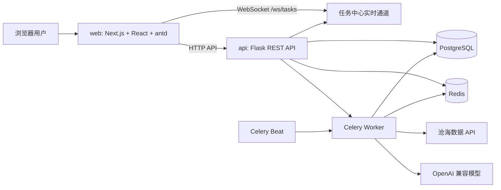

# Stock Broker

AI 量化策略研究平台。项目围绕数据同步、策略搭建、AI Agent 迭代、回测预览和回测实验室评估构建，按 `api/`、`web/`、`docker/` 三段式组织。

## 总体架构



核心运行单元：

- `web/`：Next.js App Router 前端，使用 antd 6、ECharts、Lottie，负责页面交互、K 线展示、规则引擎编辑、任务中心悬浮球和主题切换。
- `api/`：Flask API 服务，使用 SQLAlchemy、Flask-Migrate、JWT、Flask-Sock，提供认证、数据中心、策略、AI Agent、回测实验室、系统设置等接口。
- `PostgreSQL`：持久化用户、设置、基础字典、行情、策略、Agent 任务、评估结果、事件日志。
- `Redis`：Celery broker/result backend，同时支撑异步任务状态与任务中心刷新。
- `Celery Worker`：执行数据同步、AI Agent 迭代、策略评估等耗时任务；HTTP 接口只负责入队并立即返回 `taskId`。
- `Celery Beat`：执行周期任务，例如数据源状态检测。

## 目录结构

```text
api/
  app/
    models/       SQLAlchemy 模型
    routes/       Flask API 路由
    services/     业务逻辑、回测、评分、数据同步、AI 调用
    tasks/        Celery 异步任务和周期任务
  migrations/     Flask-Migrate/Alembic 迁移
  pyproject.toml  uv 依赖配置

web/
  app/            Next.js App Router 页面
  components/     复用组件
  lib/            API client、类型、工具函数
  public/         Lottie 等静态资源

docker/
  docker-compose.dev.yml  本地基础设施与 worker beat
  docker-compose.yml      容器化完整栈
  .env.example            Docker 环境变量模板
```

## 后端模块

### 认证与设置

- 用户注册、登录、JWT 鉴权。
- 系统设置存入 `settings` 表。
- 数据源配置目前面向沧海数据 API Key。
- AI 配置支持多个 OpenAI 兼容模型，列表顺序可拖拽，第一个模型作为默认模型。
- 浏览器桌面通知开关由设置持久化，开启时由前端请求浏览器权限。

### 数据中心

数据中心面向沧海数据，当前已覆盖：

- 国家/地区清单。
- 交易所清单。
- 股票清单。
- 指数清单。
- 股票历史日线。
- 指数历史日线。
- 交易日历。
- 股票历史送股/拆股信息。

同步接口统一走异步任务：

```text
前端点击同步
  -> Flask API 创建 Celery 任务并返回 taskId
  -> Worker 调用沧海数据接口
  -> 写入 PostgreSQL
  -> 写入 event_logs
  -> 任务中心通过 WebSocket/刷新展示状态
```

股票历史日线同步会自动拉取送股/拆股信息。行情浏览和回测使用后复权/调整逻辑时，应通过服务层统一取数，避免 K 线断层影响策略测算。

### 策略搭建

- 策略列表使用真实 API 数据，支持筛选、分页、排序、查看、编辑、归档、删除。
- 新建策略支持选择国家/地区、资产类型、股票/指数标的。
- 规则引擎使用结构化表达式 JSON，而不是自由字符串，便于校验、编辑、拖拽排序和后端计算。
- 支持的基础变量、技术指标和函数由后端规则/回测服务统一解释，避免前后端口径不一致。
- 策略预览会动态计算规则中用到的指标，并输出收益、回撤、Sharpe、波动率、胜率、交易次数、成交明细和净值曲线。
- 回测成交假设为次日开盘成交，并支持期末强制平仓，但未来操作判断不会被期末强制平仓污染。

综合分数统一由后端服务计算：

```text
综合分数 = 年化收益 * 0.7 + Sharpe * 5 - 最大回撤 * 0.2
```

### AI Agent

AI Agent 用于在单一股票或指数上自动迭代策略：

- 新建任务时选择 AI 模型、标的、回测区间、目标年化收益、最大可接受回撤、最低 Sharpe、初始资金、仓位、止盈止损等参数。
- 每轮由大模型输出分析、行动计划和策略 DSL。
- Worker 执行回测后保存该轮收益、回撤、Sharpe、交易次数、持续持有对比和规则内容。
- Agent 记忆保留最近 10 次表现和开始以来最佳 3 次表现，供后续轮次反思。
- 提示词强调交易次数过低通常意味着买卖条件过苛刻，但不在代码层面限制模型选择。
- 支持停止信号：任务每轮结束后检测停止请求，若存在则优雅结束并标记为已停止。
- Agent 任务会进入右下角悬浮任务中心，展示进度、最佳收益、最大回撤等关键状态。

当前策略模式由提示词交给模型选择：

- `continue_best`：延续最佳。
- `refine_recent`：优化近期。
- `explore_new`：探索新结构。
- `mutate`：突变。

### 回测实验室

回测实验室用于策略生成后的综合评估，而不是单次策略预览：

- 策略保存后自动创建/更新评估。
- 也可以在策略列表或评估详情中手动重新评估。
- 自动评估时，若存在 AI 模型，则由默认模型从已有日线数据的同国家、同类型标的中选择风格相近的标的；没有可用模型时降级为随机选择。
- 重新评估时可手动选择有数据的标的，也可让 AI 添加。
- 跨标的通用性：在相似标的上评估策略表现。
- 跨时间区间稳定性：使用最近 5 个单年、最近 3 个连续 3 年区间、最近 2 个连续 5 年区间。
- 交易健康度：关注交易次数、持仓比例、错失上涨区间、避险区间等。
- 详情页展示规则快照、评估概览、AI 建议、各评估样本的指标、图表和交易明细。
- “生成更优策略”会结合现有评估和 AI 建议对当前策略做微调，保留优势、弥补劣势，并打开新建策略页预填结果。

评估概览综合评分由多维评估聚合得到：

```text
评估总分 = 跨标的得分 * 0.25
         + 跨时间得分 * 0.35
         + 风险控制得分 * 0.20
         + 交易健康度 * 0.10
```

单个样本是否通过依赖统一综合分数与关键指标，而不是只看收益率。

### 任务中心与日志

- 长任务统一写入任务中心，前端通过 `/ws/tasks?token=...` 接收实时更新。
- 右下角 Lottie 悬浮球展示进行中任务和最近完成任务。
- `event_logs` 是通用事件日志，不只记录同步，也记录 Agent、评估等系统事件。
- 日志带有分类和可见性控制，页面只展示对应业务需要的日志。
- 页面日期显示统一按北京时间处理。

## 前端模块

主要页面：

- `/login`：登录。
- `/register`：注册。
- `/`：总览，展示真实 API 指标。
- `/data-center`：数据中心、数据同步、行情浏览器、交易日历、数据源状态。
- `/strategy-builder`：策略列表。
- `/strategy-builder/new`：新建策略。
- `/strategy-builder/[id]`：策略详情/编辑/预览。
- `/agent-tasks`：AI Agent 任务列表。
- `/agent-tasks/new`：新建 AI Agent 任务。
- `/agent-tasks/[id]`：AI Agent 任务详情。
- `/backtest-lab`：回测实验室列表。
- `/backtest-lab/[id]`：评估详情。
- `/settings`：系统设置。

前端约定：

- 组件库统一使用 antd 6。
- 图标统一使用 `@ant-design/icons`。
- 空状态统一使用 Lottie 动画和提示文案。
- 页面切换 loading 与首次进入 loading 使用同一套 Lottie 风格，并跟随明暗主题。
- 明暗模式持久化到浏览器本地状态，刷新后保持上次选择。
- 行情图表使用 ECharts，K 线、成交量、缩放、收益曲线等由专门组件承载。

## 关键数据表

主要模型位于 `api/app/models/`：

- `users`：用户。
- `settings`：用户系统设置。
- `countries`：国家/地区。
- `exchanges`：交易所。
- `stocks`：股票基础信息。
- `stock_daily_bars`：股票历史日线。
- `stock_splits`：股票送股/拆股。
- `index_assets`：指数基础信息。
- `index_daily_bars`：指数历史日线。
- `trading_calendar_days`：交易日历。
- `data_source_statuses`：数据源状态检测。
- `strategies`：策略。
- `strategy_evaluations`：回测实验室评估。
- `agent_tasks`：AI Agent 任务。
- `agent_iterations`：AI Agent 迭代记录。
- `event_logs`：通用事件日志。

## 本地开发

### 启动基础设施

```bash
cd docker
cp .env.example .env
docker compose --env-file .env -f docker-compose.dev.yml up -d
```

### 启动 API

```bash
cd api
cp .env.example .env
uv sync
uv run flask --app app run --host 0.0.0.0 --port 8000 --debug
```

### 数据库迁移

```bash
cd api
uv run flask --app app db upgrade
```

创建迁移：

```bash
cd api
uv run flask --app app db migrate -m "describe change"
```

### 启动 Celery Worker

Windows 本地建议使用 `solo` pool，避免多进程权限问题：

```bash
cd api
uv run celery -A app.celery worker --loglevel=info --pool=solo
```

Linux/macOS 或容器中可使用默认 worker pool：

```bash
cd api
uv run celery -A app.celery worker --loglevel=info
```

### 启动 Celery Beat

```bash
cd api
uv run celery -A app.celery beat --loglevel=info
```

### 启动前端

```bash
cd web
cp .env.example .env.local
pnpm install
pnpm run dev
```

### 完整容器栈

```bash
cd docker
docker compose --env-file .env -f docker-compose.yml up --build
```

## 环境变量

API 常用变量：

- `DATABASE_URL`：PostgreSQL 连接串。
- `REDIS_URL`：Redis 连接串。
- `CELERY_BROKER_URL`：Celery broker。
- `CELERY_RESULT_BACKEND`：Celery result backend。
- `CELERY_BEAT_SCHEDULE_FILENAME`：Celery beat 本地 schedule 文件路径，可为空。
- `CORS_ORIGINS`：允许访问 API 的前端地址。
- `JWT_SECRET_KEY`：JWT 签名密钥。
- `JWT_ACCESS_TOKEN_EXPIRES`：登录 token 有效期，单位秒。
- `SYNC_TASK_TIMEOUT_SECONDS`：同步、Agent、评估等后台任务超时时间，默认 3600 秒。

Docker 常用变量：

- `DB_USERNAME`、`DB_PASSWORD`、`DB_DATABASE`、`DB_PORT`。
- `REDIS_PORT`。
- `API_PORT`、`WEB_PORT`。
- `NEXT_PUBLIC_API_BASE_URL`。

沧海数据 Token 和 AI 模型配置不建议写死在环境变量中，应通过系统设置页面维护。

## 开发约定

- 耗时操作必须进入 Celery，HTTP 接口只返回任务 ID。
- 新增异步任务时要同步考虑事件日志、任务中心状态和 WebSocket 推送。
- 后端涉及收益、回撤、Sharpe、综合分数等计算时，优先复用统一服务，避免多个模块各算一套。
- 国家/地区字段统一存 ISO 代码，例如 `USA`、`CHN`，展示层再决定是否显示中文名称。
- 数据同步和行情查询不要默认全量请求远程接口，必须优先使用数据库已有日期做增量补全。
- AI 生成策略必须经过 DSL 校验和回测验证，不能直接落库为正式策略。
- 前端页面文件过大时应拆分为组件、hooks、常量和工具函数，保持页面文件只负责编排。
- 不要在代码中硬编码真实 API Token、JWT Secret 或数据库密码。

## 常用检查

前端类型检查：

```bash
cd web
pnpm exec tsc --noEmit --pretty false
```

后端语法检查示例：

```bash
cd api
uv run python -m py_compile app/services/strategy_service.py
```
